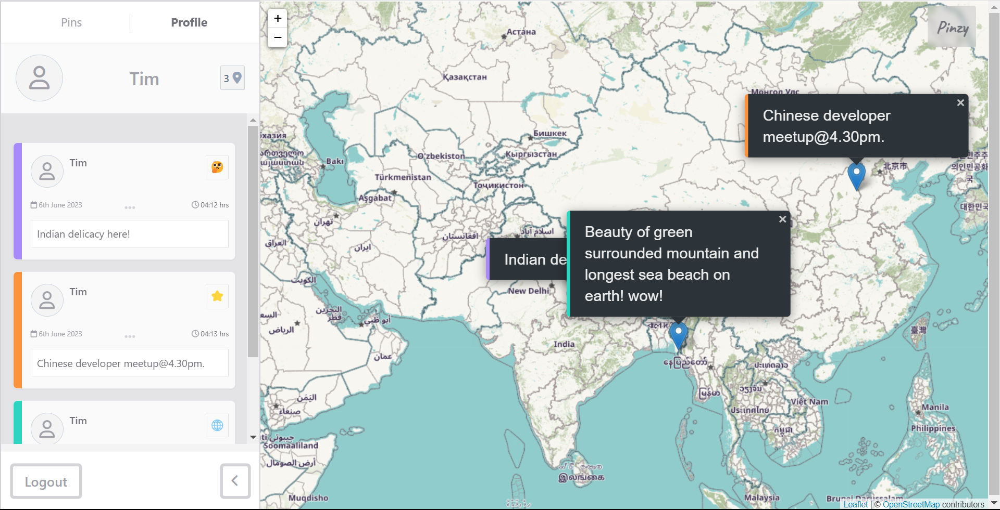

# Pinzy

Welcome to Pinzy. This is a web GIS social media. Create pins with your message to the globe and raise awarness, build a bridge between you and your customers, easily create your event and send your message across the globe.

## Features

### User authentication and registration.

You have **Login**, **signup** and **guest** options here.

### Guest

Let you explore the app without signing up. 🚀

Here is how the guest profile looks like -

- Guest feature allows you explore the pinzy as a guest.
- Limits to 10 pins with full CRUD using local storage.

## User

- Unlimited pins
- customization of profile (Not yet implemeted)
- Data stored in the server

## Pins ( Feed )

- You have all the pins of Pinzy user's pins here. Feed page.

# Technical aspects

## frontend 🧑‍💻

- custom client-side auth logic, escaping fishy chars like script execution from client-side and sanitizing user input in general.
- Debouncing for the form (pin submission) validation boosting performance.
- Used fontAwesome locally due to CORS issue by fa scripts.
- Guest users are stored in localstoarge **Plz delete all pin** before logging out and free your localstorage. I will implement algorithm with expiry date set along the data later on.
- Tailwind css is used for flexibility, maintenance and fast development.

## Backend 🧑‍💻

- custom Auth logic, used PDO and param binding for SQL-injection prevention
- custom RestAPI for fetching data
- signed users are stored in the mysql db with unlimited pin privilege.
-

This is not a production ready app to tackle huge user interaction but a demo webapp for the future ( next verion ) Pinzy release and to solidify my understanding of _MVC_, _OOP_ with vanilla **JS**, **Php** and **MySql**.

## Thrid party

- Leaflet JS 🍃
- Tailwind
- fontAwesome

## Noticeable BUGS and third-party issue 🐛

- This application uses Leaflet which, in worst cases like slow internet, is noticed to have extremely slow peroformance. The initial load of the map takes too long.
- openstreet map server may be down sometimes or your request may take too long to respond.
- Using it one browser sometimes won't load the map for some reason idk yet.Especially sometimes having trouble loading the map and pins on Microsoft Edge even though cache are diabled.
- Upon signup or login sometimes pin is not submitted to backend.

Latter two bugs are soemthing I will be working on to fix. If you notice the possible issue please notify me or make a pull request. I would be grateful to you. 🙏
