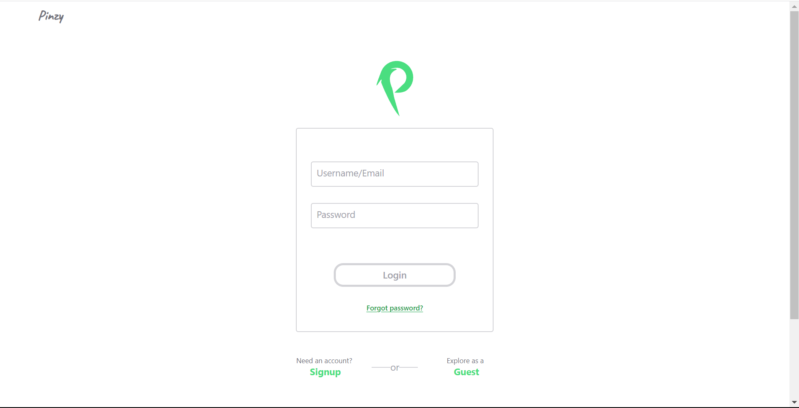
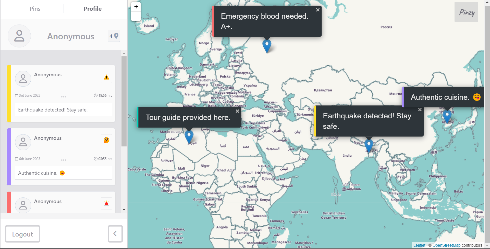
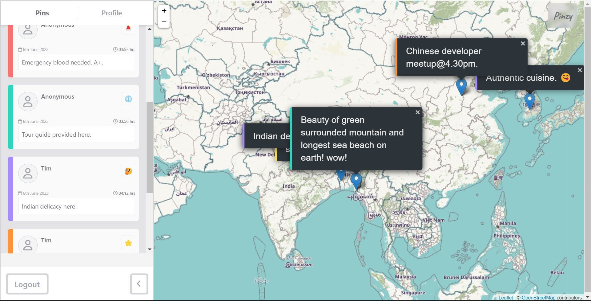

# Pinzy

Welcome to Pinzy. This is a web GIS social media. Create pins with your message to the globe and raise awarness, build a bridge between you and your customers, easily create your event and send your message across the globe.

This version has minimal featues included to make it CRUD.

## Features

### User authentication and registration.

You have **Login**, **signup** and **guest** options here.

### Guest

Here is how the guest profile looks like -

- Guest feature allows you explore the pinzy as a guest.
- Limits to 10 pins with full CRUD using local storage.

## User

- Unlimited pins
- customization of profile (Not yet implemeted)
- preferences (Not yet implemented)
- Data stored in server ( Not yet imeplemented but the user information)

## Pins ( Feed )

- You have all the pins of Pinzy user here. Feed.

# Technical aspects

- Debouncing for the form validation ( not on the auth yet)
- Used fontAwesome locally due to CORS issue by fa scripts.
- *NOTE* i am not sending the user pins to the backend due to lack of time to work on this project but I am going to store user pins to the backend soon.

This is not a production ready app to tackle huge user interaction but a demo webapp for the future Pinzy release and to solidify my understanding of _MVC_, _OOP_ with vanilla **JS**, **Php** and **MySql**.

## Noticeable Drawbacks

- This application uses Leaflet which, in worst cases like slow internet, is noticed to have extremely slow peroformance. The initial load of the map takes too long.
- openstreet map server may be down sometimes or your request may take too long to respond.
- Using it one browser sometimes won't load the map for some reason idk yet.Especially sometimes having trouble loading the map and pins on Microsoft Edge.
